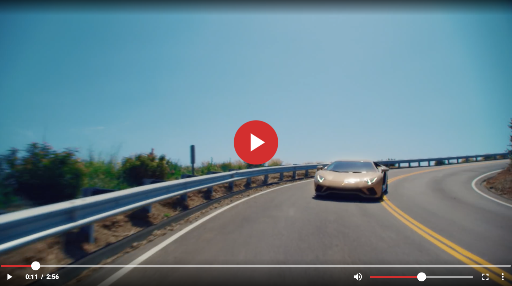

# \<mp4-video-player\>

<p align="center">
  <a href="https://travis-ci.org/thuoe/mp4-video-player">
    
  </a>
  <a href="https://david-dm.org/thuoe/mp4-video-player" title="dependencies status">
    
  </a>
  <a href="https://david-dm.org/thuoe/mp4-video-player?type=dev" title="devDependencies status">
    
  </a>
</p>

<p align="center">A simple and customizable MP4 video player web component created using Polymer 3.</p>

> ## 🛠 Status: In Development
> This component is currently in development. It's on the fast track to a 1.0.0 release, so I encourage you to use it and give feedback, but there are things that haven't been finalized yet and you can expect some changes.




## Running Demo

```
$ npm start
```
This involves using the Polymer CLI  command `polymer serve`. 

First, make sure you have the [Polymer CLI](https://www.npmjs.com/package/polymer-cli) and npm (packaged with [Node.js](https://nodejs.org)) installed. Run `npm install` to install the element's dependencies. This development server will transpile ES6 code to ES5 using [Babel](https://babeljs.io/) during runtime.

The live demo page will be available to view via `http://127.0.0.1:8081/components/@thuoe/mp4-video-player/`

## Running Tests

```
$ npm test
```

## Running ESLint

```
$ npm run lint
```

## Video Player Properties

The following properties below are accessible and writable to use:

| Property               | Description                                                        | Type    | Default Value |
|------------------------|--------------------------------------------------------------------|---------|---------------|
| `title`                | Title positioned on top of the video player                        | String  | `undefined`   |
| `videoFilePath`        | Relative file path to .mp4 video                                   | String  | `undefined`   |
| `poster`               | File path to poster image. It can be a relative or absolute URL    | String  | `undefined`   |
| `showThumbnailPreview` | Determines if the thumbnail previews show above the timeline track | Boolean | `false`       |
| `volume`               | The volume scaled from 0-1                                         | Number  | `0.5`         |
| `time`                 | The current time in seconds of the video playback                  | Number  | `0`           |


## Video Player Read-Only Properties

The following properties below are accessible but cannot be altered dynamically:

| Read-only property | Description                                              | Type    | Default Value |
|--------------------|----------------------------------------------------------|---------|---------------|
| `duration`         | The total duration of the video file after it has loaded | Number  | `0`           |
| `playing`          | If the video is playing                                  | Boolean | `false`       |
| `muted`            | If the video is muted                                    | Boolean | `false`       |
| `fullscreen`       | If the video is in fullscreen mode                       | Boolean | `false`       |

## Custom CSS Properties

The following custom CSS variables are also available for custom styling the video player:

Custom property | Description | Default Value
------------------------------------------|-------------------------------------------------------------|----------------------
`--video-title-color`                     | Color of the video title                | `rgba(255,255,255,.9)`
`--video-min-width`                       | The minimum width of the video player   | `600px`
`--video-min-height`                      | The minimum height of the video player  | `400px`
`--video-large-play-button-color`         | Large play button color                 | `#d32f2f`
`--video-large-play-button-hover-color`   | Large play button hover color           | `#9a0007`
`--video-track-fill-color`                | Track fill color                        | `#d32f2f`
`--video-thumb-color`                     | Thumb color used for dragging           | `#fff`
`--video-control-icons-background-hover-color` | Control icons background hover color  | `#d32f2f`
`--video-thumbnail-background-color`      | Thumbnail track background color        | `rgba(255,255,255,.9)`
`--video-menu-background-color`           | Menu background color                   | `rgba(255,255,255,.9)`
`--video-menu-item-color`                 | Menu item background color              | `rgba(255,255,255,.9)`
`--video-menu-item-icon-color`            | Menu icon color                         | `black`
`--video-menu-item-hover-color`           | Menu item hover color                   | `#d32f2f`
`--video-menu-item-icon-hover-color`      | Menu icon hover color                   | `white`
`--video-tooltip-background-color`        | Tooltip background color                | `rgba(255,255,255,.9)`


### HTML Example:

```html
<!doctype html>
<html lang="en">
<head>
    <meta charset="utf-8">
    <meta name="viewport" content="width=device-width, minimum-scale=1, initial-scale=1, user-scalable=yes">
    <title>mp4-video-player demo</title>
    <script type="module">
        import '@webcomponents/webcomponentsjs/webcomponents-loader.js';
        // custom-style element invokes the custom properties polyfill
        import '@polymer/polymer/lib/elements/custom-style.js';
        import '../mp4-video-player.js'
    </script>
</head>
<body>
    <h3>Video player using custom CSS properties</h3>
    <!-- ensure that custom props are polyfilled on browsers that don't support them -->
    <custom-style>
        <style is="custom-style">
            mp4-video-player {
                /* Set the values for the custom CSS properties */
                --video-thumb-color: red;
                --video-tooltip-background-color: orange;
                --video-menu-item-hover-color: magenta;
            }
        </style>
    </custom-style>
    <mp4-video-player></mp4-video-player>
</body>
</html>
```

Or you can dynamically change the CSS properties at runtime..

```js
window.addEventListener('WebComponentsReady', () => {
  // when the video player element has finished initializing..
  const player = window.querySelector('mp4-video-player');
  player.updateStyles({
      '--video-min-width': '750px',
      '--video-min-height': '300px',
      '--video-title-color': 'red'
      ...
  });  
});
```
## Keyboard Shortcuts

This video player has intergrated the following shortcuts to further enhance
playback experience:

| Keyboard Shortcut | Intended Action   |
|-------------------|-------------------|
| `space` or `p`    | Toggle play       |
| `m`               | Toggle mute       |
| `f`               | Toggle fullscreen |
